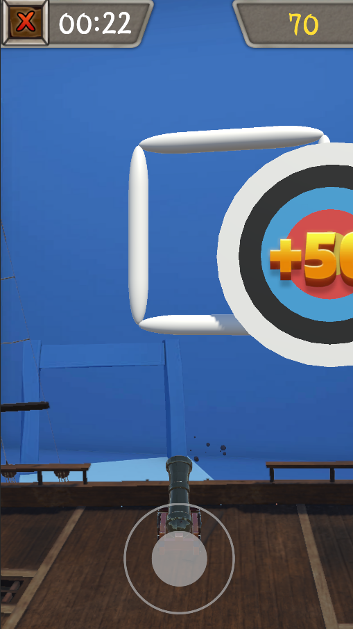
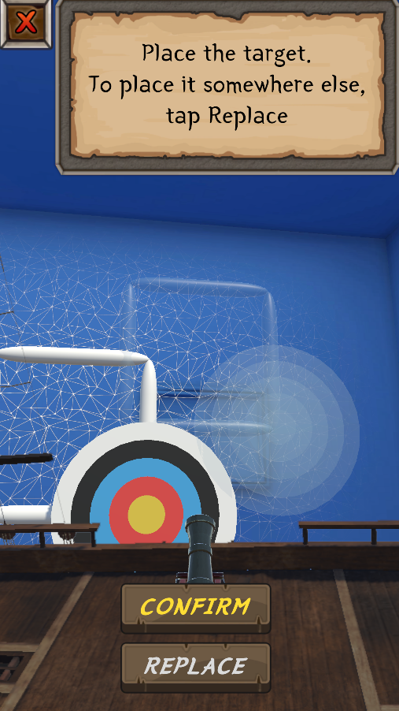

# Cannonball

A simple AR target shooting game for Android using Lightship ARDK

Shoot cannonballs at a moving target, anchored on a vertical surface in the real world without an image marker.

# Versions and Packages for Installation

To install the game itself to play, head over to the Releases page and download the latest version of `cannonball.apk`

Please ensure that your Android device has at been updated to at least Android 12 and meets the [minimum device requirements to run Lightship ARDK](https://lightship.dev/docs/ardk/ardk_fundamentals/system_reqs.html#runtime-requirements)
This project was tested on a Samsung Galaxy S10 and Samsung Galaxy S20+

For installing the project for development,

1. Ensure that you have the following:

- Unity 2021.3.14f1

These packages are already included in the project files:

- Lightship ARDK 2.3.1
- Text Mesh Pro 3.0.6
- 2D Sprite 1.0.0

2. Use Unity Hub to open the project.

# Player Controls

On opening the application, the player needs to shoot the target board to start the AR experience.

The player drags the joystick at the bottom of the screen to aim, making a trajectory path appear.
On releasing the joystick, a cannonball is fired. This teaches the player the main interaction even before they start playing, for a seamless experience.

Upon entering the AR scene, the player is given a safety warning, and then they are guided through
a process of placing the targetboard on a wall or vertical surface.

When the "Find a vertical surface..." message is shown, the app will
only show a `Next` button after a plane is detected.

If the player stands too close to the target board (0.5m), they are reminded
to move back or place the target board further away.  
The player is allowed to ignore this warning and continue playing.

The player is given a confirmation screen about its placement. If they wish to reposition the targetboard, they may do so using the `Replace` button.

The player then hit `ARR` to start their 30s session of shooting.

# Testing in the editor

To test the project in Unity Editor,

1. Set the play resolution to a portrait resolution, such as 1440 x 2560 or 1080 x 1920

2. In the AR Cannon Scene, enable the -- Static -- > Mock Interior for Testing object before pressing the play button.

3. Enter Play mode by pressing Unity's Play button.

4. To move around the space, use the WASD keys, and Q and E to ascend or descend. To look around, hold the right mouse button down and drag.

# Known Issues

Due to the limitations of Unity's collision detection system, it is possible for 1 cannonball to hit 2 scoring zones, giving the player more points.

A saving system was not implemented, making the highscore reset every time the app is opened. This is fair because if the player goes to a new location, their highscore should not be compared to that of the previous location.

# Further Improvements

- If there isn't a big performance hit, real-world object occlusion could be implemented using the ARDK to give the game more realism, and let walls or trees block the cannonball. This should be disabled by default for phones which do not have sufficient processing power.
- Object pooling can be implemented for the cannonballs and the score particles to reduce the memory required
- For UX, a `3-2-1-start!` effect could be implemented before the start of each shooting session

# Asset Credits

- [Hand Painted Cannon model](https://skfb.ly/oopWA) by carlosbarrera\_10, licensed under CC Attribution
- [Cannon Shot sound](https://freesound.org/people/qubodup/sounds/187767/) by qubodup, licensed under CC0
- [Point Scoring sound](https://freesound.org/people/ani_music/sounds/198390/) by ani\_music, licensed under CC0, edited in Audacity
- [Screen shake script and explosion particle effect](https://www.youtube.com/watch?v=RnEO3MRPr5Y) by Adam Konig
- [The Siren's Light Pirate Ship](https://skfb.ly/RqTz) by Krimsun, licensed under CC Attribution
- [Fantasy Wooden GUI: Free](https://assetstore.unity.com/packages/2d/gui/fantasy-wooden-gui-free-103811) by Black Hammer on Unity Asset Store
- [Joystick Pack](https://assetstore.unity.com/packages/tools/input-management/joystick-pack-107631) by Fenerax Studios on Unity Asset Store
- [Score UI and Title: 20 Logo Templates](https://assetstore.unity.com/packages/2d/gui/icons/20-logo-templates-with-customizable-psd-vector-sources-174999) by Pirate Parrot on Unity Asset Store
- [Yeonsung Font](http://font.woowahan.com/yeonsung/) by Woowa Brothers, free for commercial use
- [Pirate Photo](https://unsplash.com/?utm_source=unsplash&utm_medium=referral&utm_content=creditCopyText) by Philipp Deus on Unsplash
  